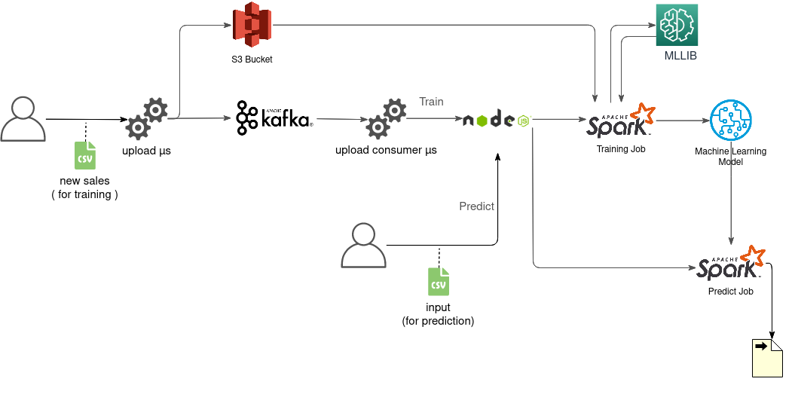
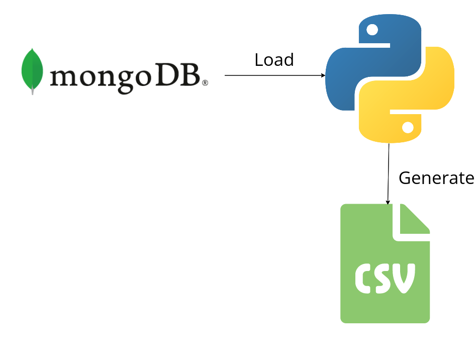

# Big Data Pipeline 

## Overview 

This is our project for the **Big Data** workshop. A pipeline that trains a model on a list of **Sales** and then predicts the quantity of sales for a certain day. Uses **spark** and **mllib**, **kafka** for streaming, **Express** as an Http Server, **Amazon S3** for Storage in addition to **spring boot**.

## Architecture




### Importing Phase

We start by training our model on new *sales*. Sales have the following structure initially

```csv
product_id	product_name	product_price	store_id	store_name	quantity	date
```

#### Data Generation



Since we don't have initial data we had to create a dataset ourselves. For that we loaded some data available in a mongo database ( products and stores ). We then generated a number of sales following a certain number of rules. The process is described in details in [cvs_generator.py](forecast-db/csv_generator.py)

#### Importing the Data

We start by uploading the sales to the `upload microservice` ( written in **spring boot**). This microservice starts by sending the file to an `S3 bucket` and then produces a message through kafka containing the **file url** in the `S3 bucket`

the `upload consumer microservice` ( written in **spring boot**) consumes that message and sends the url to an `http server`( written in `express` and saved in the same server as `spark`). This `http server` then starts the `spark training job` (asynchronously) and returns a response that the job has started.

> - We added the `upload consumer` to decouple the **http server** and the **upload microservice**. The point is to ensure that the initial upload happens without issues, so any issues with the spark server would be treated lndividually later on. This also helps to verify the integrity of the data in the consumer before sending the command to the http server and starting the job.
> - Since our `csv` files are quite large. We opted to sending only the **file url** through our pipeline. This ensures that :
>   - The File is well persisted before any operation. We won't have data loss in case of failures.
>   - We will minimize the size of our messages sent through **kafka** and therefore eliminate unnecessary overhead.

### Training Phase

The `spark training job` ( called `spark import` in the project ) launches while taking the `url` as its only argument. It starts by Loading the data from the `s3 bucket`. then it **cleans the data** and **creates the model**.

> Note that instead of using the RDD api, we're using dataframes in order to simplify the operations on the `csv` file and the training later on.

#### Cleaning

In the cleaning process, we remove the extra fields ( store names , product names, ...) , we then divide our `date` field into `year` and `month`. We then `reduce` our data by **merging sales belong to the same store, on the same product, in the same year & month ( we sum their quantity of sales )**.

#### Training

For the training part we created a simple training **pipeline** containing 4 **stages** :

1. Store Categorizing : we index the stores
2. product categorizing : we index the products
3. assembling : we assemble the month, year, store, product into a column `features`. This will be used as our `features column` for the regressor
4. regression fitting : We set our `features column` and our `label column`(quantity)

We train and the **save the model** to be used for predictions later.

### Prediction Phase

The User can call the `http-server` while providing a `csv` file. The `http-server` will call the `spark predict job` and output the predictions using the saved `model`.
